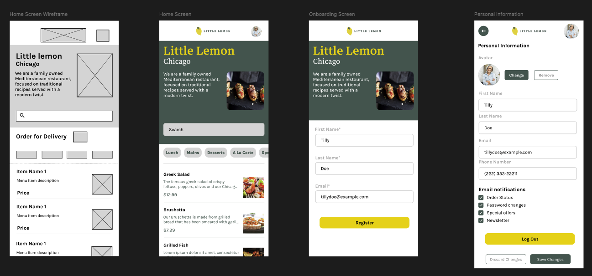

# Little Lemon iOS App Capstone

This is the final project for the iOS Developer Course. It is a functional restaurant application that includes user onboarding, a dynamic menu, and profile management with data persistence.

## 🎨 Design & Wireframes

The app structure is based on the following wireframe design.

> **View the wireframe and prototype here:** [Figma Design](https://www.figma.com/design/6cXwtglZ0pNMrB18vdB7W3/LittleLemonApp?node-id=0-1&t=Alj8QsxSs4HApuk7-1)

-----

## ✅ Key Features (Grading Criteria)

### 1\. Onboarding Flow

  * **First Launch:** Users are greeted with an onboarding sequence upon first open.
  * **Data Entry:** Prompts users for personal details (Name, Email).
  * **Navigation:** Features a multi-page layout (3 pages) with a "Next" button to progress.

### 2\. Home Screen

The Home screen includes the following required sections:

  * **Header:** Standard app branding.
  * **Hero Section:** Displays the Little Lemon description and a functional **Search Bar**.
  * **Menu Breakdown:** A scrollable bar of selectable categories (Starters, Mains, Desserts, Sides) to filter the list.
  * **Food Menu List:** A summarized view of menu items fetched from the server.

### 3\. Profile & Persistence

  * **Data Retention:** User data entered during onboarding is saved and persists even after the app is restarted.
  * **Profile View:** accessible via the Home screen, displaying the user's saved information.
  * **Logout:** A functional "Log out" button that clears all user data (Core Data/UserDefaults) and resets the navigation stack to Onboarding.

### 4\. Navigation

  * Uses **Stack Navigation** allowing users to utilize the standard Back button to return to previous screens.

-----

## 📱 App Screenshots

-----

## 🚀 How to Run

1.  Download the project files.
2.  Open `LittleLemonApp.xcodeproj` in Xcode.
3.  Wait for Package Dependencies (if any) to resolve.
4.  Select an iPhone Simulator (e.g., iPhone 14/15 Pro).
5.  Press **Cmd + R** to build and run.
